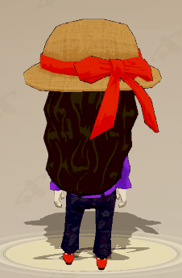
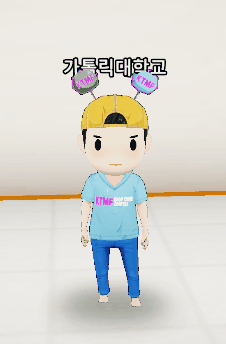

# MagicaCloth

* 옷이나 머리카락 등 의상 프리팹에 들어가는 Bone
* 해당 Bone을 적용하면 자동으로  계산되어 흔들린다

## ★ Document

* 매지카 클로스 공식 문서 주소
* [MagicaSoft Unity Assets](https://magicasoft.jp/unity3d/)/[Magica Cloth](https://magicasoft.jp/magica-cloth/) 카테고리 참고



## ★ Asset

* 유니티 스토어 에셋 주소




<mark style="background-color:blue;">Magica Cloth 2 출시 (릴리스 날짜: 2023년 2월 11일)</mark>

[<mark style="background-color:blue;">https://assetstore.unity.com/packages/tools/physics/magica-cloth-2-242307#content</mark>](https://assetstore.unity.com/packages/tools/physics/magica-cloth-2-242307#content)


## 1. 사용 에셋 및 Bone 적용 방법


※ 캐릭터 팀에서 프리팹 제작 시 사전에 Bone 설정과 컴포넌트를 세팅하여 넘겨준다.

클라이언트 팀은 세팅된 프리팹을 받아 전역에 사용되는 아바타 Root Bone 프리팹에 적용하는 작업만 해주면 된다.


### ● Bone Cloth

* 팔랑 거리는 재질에 사용 (머리카락, 리본, 끈 등)

<figure><figcaption>
머리카락과 모자 리본에 BoneCloth 적용
</figcaption></figure>

#### 1) Bone 이식

1-1)  캐릭터 팀에서 전달한 프리팹 중 신규 Bone을 가진 것이 있다면 해당 프리팹의 구조를 연다.

<figure><figcaption>
예시 - downponytail 프리팹
</figcaption></figure>

1-2) Magica 컴포넌트를 확인하여 신규 추가된 Bone을 확인한다. (위 이미지의 붉은줄 참고)

1-3) Assets\_DEV\Prefab\Avatar\Root 프리팹의 동일한 위치에 해당 Bone을 복사 붙여넣기 한다.&#x20;

<figure><figcaption>
예시 - Root 프리팹
</figcaption></figure>

1-4) 붙여 넣은 Bone의 Transform 값이 같은지 확인한다.

<figure><figcaption>
동일한 Transform 컴포넌트 값
</figcaption></figure>

#### 2) Bone 편집

2-1) 1에서 Root에 붙여 넣은 Bone 오브젝트를 Magica Bone Cloth 컴포넌트의 RootList에 추가

<figure><figcaption></figcaption></figure>

2-2) 하단의  Start Point Selection 버튼을 누른다.

<figure><figcaption></figcaption></figure>


&#x20;신규 추가 된 Bone은 기능이 비활성화 되어있다.&#x20;

기능하게 하려면 Bone의 포인트 편집이 필요하다.


2-3) 2-2의 버튼을 누르면 편집 모드로 변경된다.&#x20;

<figure><figcaption></figcaption></figure>

<table><thead><tr><th width="188">구분</th><th>설명</th></tr></thead><tbody><tr><td>🟢 Move Point</td><td>움직이는 것이 가능한 포인트 물리 엔진의 영향을 받는 움직이는 부위는 해당 포인트로 설정하여야 한다.</td></tr><tr><td>🔴 Fixed Point</td><td>고정된 포인트 고정 포인트 없이 Move Point만 있으면 물리 엔진의 영향으로 전체가 떨어지므로, 기본적으로 움직이는 포인트의 뿌리 부분으로 설정한다. 주로 몸이나 옷에 붙어있는 부분이 해당된다.</td></tr><tr><td>⚫ Invalid Point</td><td>유효하지 않은 포인트 물리 계산에서 제외된다. 불필요한 포인트를 해당 포인트로 설정하면 부하를 줄일 수 있다.</td></tr><tr><td>Fill</td><td>세 가지의 포인트 중 하나를 선택한 채로 해당 버튼을 누르면 오브젝트의 모든 포인트가 선택한 포인트로 설정된다.</td></tr></tbody></table>

2-4)  Bone 포인트를 설정해준다.

&#x20; (1).png>)


최초로 본을 이식했다면, 이식해 온 Bone은 Invaild Point로 인식되어 회색 파티클로 보인다. 원본 프리팹의 설정을 확인한 다음 해당 Bone을 동일하게 설정해준다.

(※ 기즈모를 켠 상태)


2-5) 설정이 완료되었다면 End Point Selection을 눌러 설정을 종료한다.

<figure><figcaption></figcaption></figure>

2-6) 수정된 사항이 있다면 Create 버튼을 눌러 2-5에서 설정 완료한 Bone 설정을 저장한다.

<figure><figcaption></figcaption></figure>


2-5 이후 Create를 누르지 않거나  Bone 에러가 발생하면 이와 같은 경고 문구가 발생한다.

보통 Create 버튼을 누르면 사라진다.

 (1).png>)


### ● Bone Spring

* 탄성을 지닌 재질에 사용 (스프링 느낌이 나는 오브젝트(KTMF 모자 장식) 등)

<figure><figcaption>
모자에 달린 오브젝트에 BoneSpring 적용
</figcaption></figure>

#### 1) Bone 이식

1-1) 캐릭터 팀에서 전달한 프리팹 중 신규 Bone을 가진 것이 있다면 해당 프리팹의 구조를 연다.

<figure><figcaption></figcaption></figure>

1-2) Magica 컴포넌트를 확인하여 신규 추가된 Bone을 확인한다. (위 이미지의 붉은줄 참고)

1-3) Assets\_DEV\Prefab\Avatar\Root 프리팹의 동일한 위치에 해당 Bone을 복사 붙여넣기 한다. (MagicaBoneSpring 컴포넌트는 Magica Bone Cloth 오브젝트에 있다.)

<figure><figcaption></figcaption></figure>

1-4) 별도의 Bone 편집 없이 이식 후 Create 버튼을 누르면 완료된다.


※ 프리팹에 본 세팅을 했는데도 실행 시 적용이 안 될 시

AvatarParts 프리팹에서 수정한 Root 프리팹을 바꿔끼거나, 해당 상태에서 Root 프리팹으로 들어가 수정한다.

.png>)

