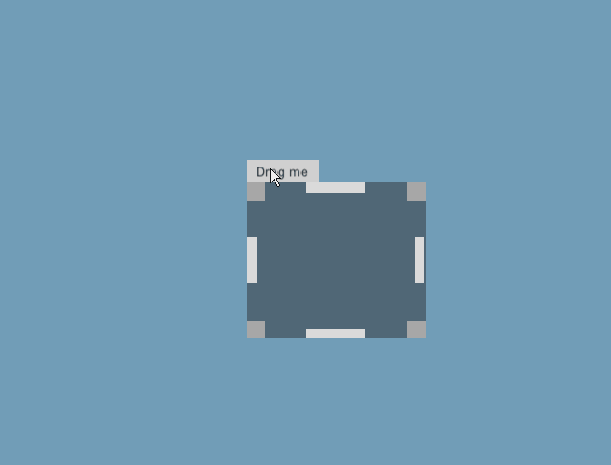

# Flexible Draggable & Resizable UI Object



### 드래그

> * 드래그 할 UI에 컴포넌트 추가
> * 드래그 될 UI를 Target으로 지정

.png>)  (1).png>)

### 리사이즈

> * 리사이즈 핸들이 될 부분 UI에 컴포넌트 추가
> * 리사이즈 될 UI를 Target으로 지정
> * 위치와, min\&max 사이즈를 지정

 (1).png>) .png>)

### 결과

\\
