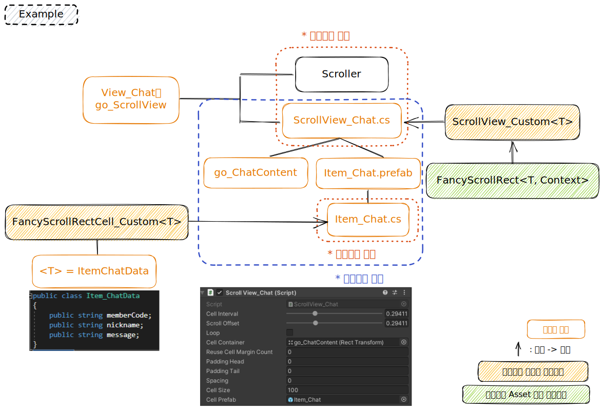

# 07\_ScrollRect

#### ○ 해당 스크롤 뷰를 사용하는 경우

* 일반적인 스크롤 뷰 기능이 필요할 시
* Loop가 필요하지 않을 시 (해당 스크롤뷰는 Loop 기능이 지원되지 않음)

***

<details>

<summary>목차</summary>

[#undefined-1](07\_scrollrect.md#undefined-1 "mention")

[#undefined-2](07\_scrollrect.md#undefined-2 "mention")

[#undefined-3](07\_scrollrect.md#undefined-3 "mention")

[#custom-scrollrect](07\_scrollrect.md#custom-scrollrect "mention")

</details>

***

### ● 구조도



***

### ● 주요 변수 및 기능 메소드

#### ▷ ScrollView.cs

<table><thead><tr><th width="418.3333333333333">변수</th><th>설명</th></tr></thead><tbody><tr><td>[SerializeField] float cellSize = 100f;</td><td>CellPrefab에 연결한 프리팹의 높이값과 일치시켜주어야 한다.</td></tr><tr><td>[SerializeField] GameObject cellPrefab = default;</td><td>FancyScrollRectCell을 상속받은 스크립트를 가진 프리팹을 연결</td></tr><tr><td>public int DataCount => ItemsSource.Count;</td><td>현재 생성된 셀의 총 개수를 알 수 있다.</td></tr></tbody></table>

<details>

<summary>public void OnCellClicked(Action&#x3C;int> callback)</summary>

```csharp
// 셀 선택 시 액션 호출
scrollview.OnCellClicked((int) => { /*선택된 셀의 인덱스가 넘어온다*/ });
```

</details>

<details>

<summary>public void UpdateData(IList items)</summary>

```csharp
// 아이템(셀)을 스크롤뷰에 생성
// 기존 아이템 전부 삭제 후 새로 받은 아이템으로 다시 생성

List<ItemData> datas = new List<ItemData>();
datas.add(new ItemData()); // 아이템 전체 데이터를 리스트로 만든다

scrollview.UpdateData(datas);
```

</details>

<details>

<summary>public void ScrollTo(int index, float duration, Ease easing, Alignment alignment = Alignment.Middle)</summary>

```csharp
// 지정한 인덱스의 셀까지 스크롤링
// (지정한 인덱스, 걸리는 시간, 이동 방식, 기준 피벗)

scrollView.ScrollTo(1, 0.3f, Ease.InOutQuint, Alignment.Lower);
```

</details>

<details>

<summary>public void JumpTo(int index, Alignment alignment = Alignment.Middle)</summary>

```csharp
 // 지정한 인덱스의 셀까지 바로 스크롤
 // (지정한 인덱스, 기준 피벗)
 
 scrollView.JumpTo(10, Alignment.Lower);
```

</details>

#### ▷ Cell.cs

<table><thead><tr><th width="325">변수</th><th>설명</th></tr></thead><tbody><tr><td>public int Index { get; set; }</td><td>오브젝트의 고유 인덱스</td></tr><tr><td>public virtual bool IsVisible { get; }</td><td>오브젝트가 하이라키에서 활성화 상태인지의 여부</td></tr><tr><td>protected TContext Context { get; }</td><td>선택된 셀 인덱스 및 셀 클릭 액션</td></tr></tbody></table>

<details>

<summary>public override void Initialize()</summary>

```csharp
// Awake의 역할
// 버튼이 있을 시 AddListener 등록
public override void Initialize()
{
    button.onClick.AddListener(() => Context.OnCellClicked?.Invoke(Index));
}
```

</details>

<details>

<summary>public override void UpdateContent(ItemData itemData)</summary>

<pre class="language-csharp"><code class="lang-csharp">// 생성 및 하이라키에서 활성화 됐을 시 해당 메소드 호출
// 호출 될 때마다 데이터가 들어온다
// 데이터를 받아와 처리하는 코드를 작성

public override void UpdateContent(ItemData itemData)
{
<strong>    message.text = itemData.Message;
</strong>
    var selected = Context.SelectedIndex == Index;
    image.color = selected 
        ? new Color32(0, 255, 255, 100)
        : new Color32(255, 255, 255, 77);
}
</code></pre>

</details>

<details>

<summary>protected override void UpdatePosition(float normalizedPosition, float localPosition)</summary>

```csharp
// Some code
```

</details>

***

### ● 컴포넌트 추가 예시

1\) 하이라키에서 Unity 기본 제공 Scroll View 를 Canvas 하위에 추가

2\) 기존 UI에서 Scroll Rect 컴포넌트를 삭제하고 Scroller와 Scroll View(에셋) 컴포넌트 추가

3\) Scroll View의 Cell Container에 아위의 Content를 연결

4\) Cell Prefab에 FancyScrollRectCell을 상속받은 스크립트를 가지고 있는 프리팹 오브젝트 연결

※ Scroll View 컴포넌트 추가 예시

 (1).png>)

※ Cell 스크립트(FancyScrollRectCell를 상속받음) 프리팹 오브젝트 예시

 (1).png>)

5\) Scroll View의 Cell Size의 값과 Cell Prefab의 높이 값을 일치시켜주어야 한다

***

## ● 실무 사용 Custom ScrollRect

(feat. 한효주 주임 연구원)

#### ○ 스크립트명: ScrollView\_Custom

#### ○ 위치: Assets\\\_DEV\Script\UI\Scroll


기존 에셋 사용 시 ScrollView\<ItemData, Context>와 같이 TItemData의 형태를 ScrollView에서 지정하고 있다.

이 경우, 여러 곳에서 다른 형태의 Data를 사용하여야 한다면 ScrollView를 여러 개로 복제하여 각각 필요한 Data 형식을 지정하여야 한다.

같은 ScrollView를 복제 시 같은 스크립트의 중복 문제 및 타 사용자의 입장에서 가독성과 해석이 어렵다고 판단하여 <mark style="background-color:red;">TItemData만을 제네릭 타입</mark>으로 넣을 수 있는 Custom Base 스크립트를 작성하였다.


#### ○사용 방법 :

ScrollView\_Custom\<T> : FancyScrollRect\<T, Context>을 상속받은 자식 클래스에서 해당 스크롤뷰에서 필요한 데이터 형식을 지정하여 사용

 (2).png>)

#### ○ 구조도










