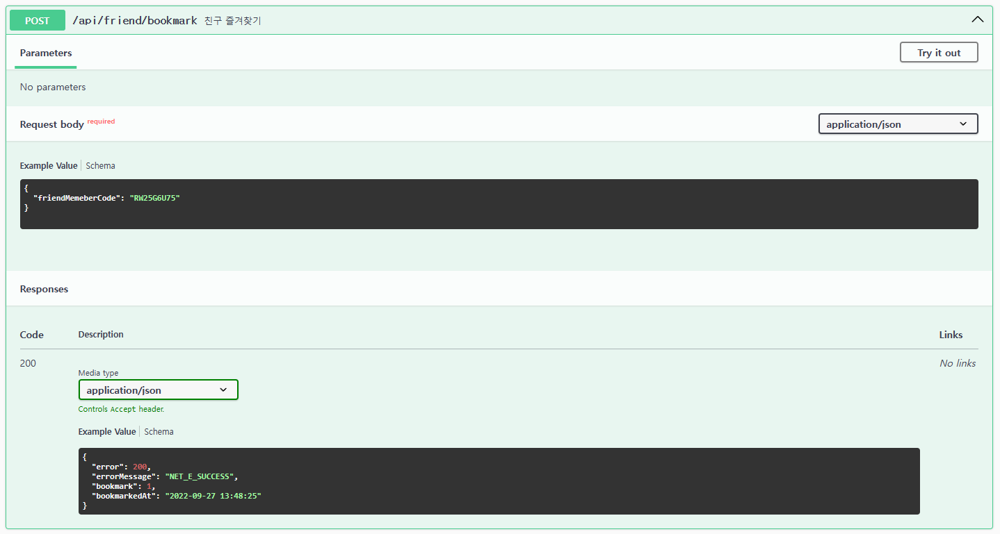

# 📱 AOS Build

**1. 플랫폼 변경 (**※ 이미 해당 플랫폼이라면 생략**)**

* File => Build Setting의 Platform 항목에서 Android 플랫폼으로 변경 (현재 플랫폼이 아닐 시 Switch Platform 클릭)

<figure><figcaption></figcaption></figure>

***

**2. AOS 빌드 설정**

2-1. SDK 설정

* Player Setting => Other Setting 항목에서 Identification의 Target API Level을 31로 설정
* 31 SDK가 설치되어있지 않을 경우 다운받아야 하는데, 자동 다운이 안 될 경우 안드로이드 스튜디오에서 설치 필요
* <mark style="color:red;">2023년 11월부터 API Level 33으로 변경되므로 유의</mark>

<figure><figcaption></figcaption></figure>

2-2. keystore 설정

* Player Setting => Publishing Setting 항목에서 Project Keystore의 패스워드 작성
* 패스워드: arzmeta (모두 동일)
* <mark style="color:yellow;">기본적으로 Custom Keystore가 설정되어 있으나, 신규 생성 시에는 Keystore manager => Create New</mark>

<figure><figcaption></figcaption></figure>

2-3. 앱 버전 및 번들 버전 코드 설정

* 앱버전 설정 규칙: 1.1.(이전 버전보다 큰 숫자) \[예시] 1.1.10 => 1.1.11
* 번들 버전 코드: 앱버전이 올라가면 같이 올림 \[예시] 1.1.10에서 43 => 1.1.11에서 44

<figure><figcaption></figcaption></figure>

<mark style="color:green;">※ 2-2, 2-3 작업 간략화</mark>

<mark style="color:green;">클라이언트팀 => 커스텀프로젝트 => 빌드설정 윈도우 클릭 시 아래 창이 열림</mark>\ <mark style="color:green;">해당 탭에서 ketstore와 앱버전, 번들 버전 코드 입력 후 '빌드설정 저장' 버튼을 눌러 저장</mark>\ <mark style="color:green;">(내부 빌드 넘버는 무시해도 되는 항목)</mark>

<figure><figcaption></figcaption></figure>

2-4. 스플래쉬 로고 설정

* Player Setting => Splash Image 항목에서 Show Splash Screen 체크 해제

<figure><figcaption></figcaption></figure>

***

**3. G-Presto 사전작업 (**※ 이미 3-1, 3-2를 진행했었다면 생략**)**

사이트 로그인 정보: [\[한컴 프론티스\] 공용\_회사정보](https://docs.google.com/spreadsheets/d/16mxmCbAMMBTSFAcaRAKQOcRlS3OhVCl-lF87yFuCf9k/edit#gid=34880051) 구글 공유 시트의 G-Presto / 보안적용 솔루션 계정 (라르고소프트) 참고

3-1. Unity MetaData 암호화 사전작업 다운로드

* G-Presto 사이트의 Unity MetaData 암호화 사전작업 다운로드 항목을 선택하고 해당 유니티 버전에 맞는 압축 폴더를 다운로드

<figure><figcaption>
압축 해제한 폴더 내의 파일을 기존 파일에 덮어씌움 (<a href="dooray://3058063351305532558/pages/3519044559836670695">앱보안 적용 (라르고소프트)</a> 참고)
</figcaption></figure>

3-2. Separate Base APK Asset 체크

* Google => Android App Bundle =>Asset Delivery Setting => Separate Base APK Asset 체크

<figure><figcaption></figcaption></figure>

***

**4. 빌드**

* Google => Build Android App Bundle 클릭
* 이름 규칙: arzMETA\_1.1.11.0
* 빌드 시 이름은 꼭 규칙에 따를 필요는 없음

***

**5. G-Presto 보안 적용**

* G-Presto 사이트의 G-Presto 보안 적용 항목을 선택하고 G-Presto 자동 서명 기능 탭의 아즈메타 클릭 (사전에 등록되어 있어 선택하기만 하면 됨)
* G-Presto 보안 적용 탭에 4에서 빌드한 aab 파일을 업로드
* 보안 적용 완료 후 자동 다운로드되며, Signed\_가 기존 파일 이름 앞에 붙음

<figure><figcaption></figcaption></figure>

***

**6. 앱 업데이트**

* [구글 플레이 콘솔](https://play.google.com/console/about/?utm\_source=google\&amp;utm\_medium=cpc\&amp;utm\_campaign=PMAX\&amp;utm\_term=%7c\&amp;utm\_content=\&amp;gad=1\&amp;gclid=Cj0KCQjwi7GnBhDXARIsAFLvH4la6q8pf2RjI61nUHdDinybkd1f6zKZanYD4jbkH7ZURhEFABpKYSYaAksVEALw\_wcB) 사이트 로그인 정보: [\[한컴 프론티스\] 공용\_회사정보](https://docs.google.com/spreadsheets/d/16mxmCbAMMBTSFAcaRAKQOcRlS3OhVCl-lF87yFuCf9k/edit#gid=34880051) 구글 공유 시트의 한컴 프론티스 대표 계정 참고. <mark style="color:yellow;">(모든 앱 => 아즈메타 => 프로덕션 => 새 버전 만들기(혹은 버전 수정)에서 aab 파일 업로드 후 우측 하단 파란색 버튼 클릭)</mark>

***

**7. 내부 테스트**

* 내부 테스트에서 프로덕션으로 버전승급(내부 테스트까지만 진행하면 됨)

<figure><figcaption></figcaption></figure>
