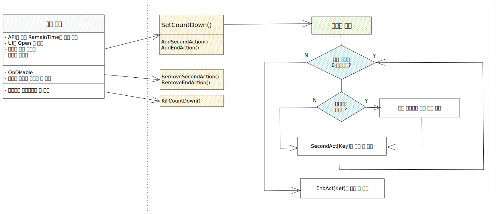

# CountDownManager

* 해당 UI 및 스크립트 외부에서 별개로 카운트 다운을 실행할 때
* 초에 따른 액션 및 카운트 다운이 끝났을 때의 액션을 사용하기 용이하게 기능화

<figure><figcaption><p>예시 - Toast_TwoBtn</p></figcaption></figure>

## 1. 중요 메소드

● 코어 메소드

<details>

<summary>public void SetCountDown(string key, int time)</summary>

```csharp
// 최초 카운트다운 실행 호출 메소드
// 필요한 시점에 호출하여 남은 시간(초)을 int로 넣어준다.
// 호출된 즉시 코루틴이 실행된다.

public void SetCountDown(string key, int time)
{
    if (!coroutineHandleDic.ContainsKey(key))
    {
        coroutineHandleDic.Add(key, default);
    }
    // key 값이 MEC 코루틴의 태그값으로 등록되며, 같은 key 값을 넣을 시 
    // 이미 딕셔너리에 있으면 새로 들어온 코루틴으로 실행한다.
    coroutineHandleDic[key] = Util.RunCoroutine(Co_CountDown(key, time), key)
}
```

</details>

<details>

<summary>private IEnumerator Co_CountDown(string key, int remainTime)</summary>

```csharp
// 카운트 다운 코루틴 메소드

private IEnumerator<float> Co_CountDown(string key, int remainTime)
{
    while (remainTime > 0)
    {
        // 카운트다운이 실행 중에 앱이 중지된 시간을 계산
        if (isComeBackApp)
        {
            isComeBackApp = false;
            Debug.Log("앱이 멈췄던 시간(초) : " + calTime);
            remainTime -= calTime;
        }

        // 1초마다 차감된 남은 시간 리턴
        // secondsAct에 액션 등록 필요
        if (secondsAct.ContainsKey(key))
        {
            secondsAct[key]?.Invoke(remainTime);
        }

        yield return Timing.WaitForSeconds(1);
        remainTime--;
    }

    // 남은 시간이 0일 시 while문 종료, endAct에 등록된 콜백 실행
    // endAct에 액션 등록 필요
    if (endAct.ContainsKey(key))
    {
        endAct[key]?.Invoke();
    }
}

#region 앱 정지 시 처리
private bool isComeBackApp = false;
private int calTime = 0;

private DateTime pauseTime;

protected override void OnApplicationPause(bool _isPaused)
{
    base.OnApplicationPause(_isPaused);

    if (_isPaused)
    {
        calTime = 0;
        pauseTime = DateTime.Now;
    }
    else
    {
        isComeBackApp = true;
        calTime = (int)(DateTime.Now - pauseTime).TotalSeconds;
    }
}
#endregion
```

</details>

● 액션 등록 및 제거 메소드

<details>

<summary>public void AddSecondAction(string key, Action&#x3C;int> action)</summary>

<pre class="language-csharp"><code class="lang-csharp">// 카운트다운이 1초 차감될 때마다 호출되는 액션 등록
// 카운트다운 코루틴이 돌기 전이나 도는 중에 해당 액션을 등록해도 된다.

public void AddSecondAction(string key, Action&#x3C;int> action)
{
<strong>    // SetCountDown에 등록한 key와 같아야 한다.
</strong>    if (!secondsAct.ContainsKey(key))
    {
        secondsAct.Add(key, default);
    }
    secondsAct[key] = action;
}
</code></pre>

</details>

<details>

<summary>public void AddEndAction(string key, Action action)</summary>

```csharp
// 카운트다운 코루틴 남은 시간이 0이 되었을 때 호출되는 액션 등록
// 카운트다운 코루틴이 돌기 전이나 도는 중에 해당 액션을 등록해도 된다.

public void AddEndAction(string key, Action action)
{
    // SetCountDown에 등록한 key와 같아야 한다.
    if (!endAct.ContainsKey(key))
    {
        endAct.Add(key, default);
    }
    endAct[key] = action;
}
```

</details>

<details>

<summary>public void RemoveSecondAction(string key)</summary>

```csharp
// AddSecondAction에서 등록한 액션 삭제

public void RemoveSecondAction(string key)
{
    // SetCountDown에 등록한 key와 같아야 한다.
    if (secondsAct.ContainsKey(key))
    {
        secondsAct[key] = null;
    }
}
```

</details>

<details>

<summary>public void RemoveEndAction(string key)</summary>

```csharp
// AddEndAction에서 등록한 액션 삭제

public void RemoveEndAction(string key)
{
    // SetCountDown에 등록한 key와 같아야 한다.
    if (endAct.ContainsKey(key))
    {
        endAct[key] = null;
    }
}
```

</details>

<details>

<summary>public void KillCountDown(string key)</summary>

```csharp
// 등록한 카운트다운 중지

public void KillCountDown(string key)
{
    // SetCountDown에 등록한 key와 같아야 한다.
    if (coroutineHandleDic.ContainsKey(key))
    {
        Util.KillCoroutine(key);
    }
}
```

</details>

&#x20;

## &#x20;2. 메소드 흐름 구조도




## 3. 사용 방법

1\) 카운트다운 등록

```csharp
// 예시 - 선택 투표 API
// LocalPlayerData.cs
public static void KTMFVote()
{
    Single.Web.selectVote.GetKTMFVoteInfo((res) =>
    {
        // 데이터 세팅 타이밍에 카운트다운 호출
        foreach (var item in Util.Enum2List<KTMF_REMAINTIME>())
        {
            CountDownManager.Instance.SetCountDown(Util.Enum2String(item), res.GetRemain(item));
        }

        OpenVotePanel(res);
    },
    (생략)
}
```

2\) 액션 등록

```csharp
// 예시 - 선택 투표 API
// Panel_KTMFVote.cs

public void SetData(GetKTMFVoteInfoPacketRes data)
{
    this.data = data;

    SetOpenStartCallback(() =>
    {
        GetView<View_KTMFVote>().SetData(data);
        GetView<View_KTMFVoteResult>().SetData(data);
        
        // 데이터 세팅 타이밍에 액션 등록 호출
        AddActionCountDown();
        SetUI();
    });
}

// 액션 등록
private void AddActionCountDown()
{
    CountDownManager.Instance.AddSecondAction(Util.Enum2String(KTMF_REMAINTIME.VoteEnd), VoteCloseCount);
    CountDownManager.Instance.AddEndAction(Util.Enum2String(KTMF_REMAINTIME.VoteEnd), VoteCloseEnd);
    CountDownManager.Instance.AddEndAction(Util.Enum2String(KTMF_REMAINTIME.ResultStart), ResultOpenEnd);
    CountDownManager.Instance.AddEndAction(Util.Enum2String(KTMF_REMAINTIME.ResultEnd), ResultCloseEnd);
}
```

3\) 액션 삭제

```csharp
// 예시 - 선택 투표 API
// Panel_KTMFVote.cs

// 스크립트가 꺼질 때마다 액션 삭제
protected override void OnDisable()
{
    CountDownManager.Instance.RemoveSecondAction(Util.Enum2String(KTMF_REMAINTIME.VoteEnd));
    CountDownManager.Instance.RemoveEndAction(Util.Enum2String(KTMF_REMAINTIME.VoteEnd));
    CountDownManager.Instance.RemoveEndAction(Util.Enum2String(KTMF_REMAINTIME.ResultStart));
    CountDownManager.Instance.RemoveEndAction(Util.Enum2String(KTMF_REMAINTIME.ResultEnd));
}
```
