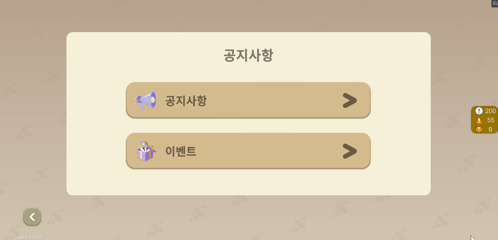

# WebViewManager

* 앱 내부에서 외부 URL 혹은 HTML을 UI에 띄울 때 사용


오피스 내부에서 사용하는 WebViewController와는 별개의 스크립트


<figure><figcaption><p>예시 - 창 모드 웹뷰</p></figcaption></figure>

## 1. 에셋도큐먼트



## 2. 중요 메소드

<table><thead><tr><th width="393">변수</th><th>설명</th></tr></thead><tbody><tr><td>public UnityAction OnStartCallback = null;</td><td>웹뷰 로딩이 완료되었을 때 호출되는 콜백</td></tr><tr><td>public UnityAction OnBackBtnCallback = null;</td><td>ESC 키, 안드로이드 백키, 툴바 종료 버튼, 예기치 못한 종료 시 호출되는 콜백</td></tr><tr><td>public UnityAction OnReceiveCallback = null;</td><td>Url 변경 시마다 호출되는 콜백</td></tr></tbody></table>

● 외부 호출 메소드

<details>

<summary>public void OpenWebView(WebViewData data)</summary>

```csharp
// 웹뷰를 호출하는 메소드
// 별도의 데이터 클래스를 파라미터로 받아 사용한다.
public void OpenWebView(WebViewData data)
{
    // WebViewData 클래스 내부의 WebSetting 클래스가 있다
    // WebSetting 데이터를 전역으로 사용하기 위해 전역변수로 저장
    setting = data.webSetting;
    // 웹뷰 데이터 세팅 및 열기
    SetWebView(data.dataSetting);
}
```

</details>

<details>

<summary>public void CloseWebview()</summary>

```csharp
// 웹뷰 종료 및 닫기
public void CloseWebview()
{
    if (webView)
    {
        OnBackBtnCallback?.Invoke();
        ResetCallback();

        // 더미 UI 스택을 쌓았을 시
        // 안드로이드 백버튼, ESC 키를 눌렀을 시 쌓인 스텍이 하나 삭제되므로 
        // 예외처리를 위해 더미 스택을 하나 쌓아두었다.
        if (setting.isStack)
        {
            SceneLogic.instance.isUILock = false;
            SceneLogic.instance.PopPopup();
        }

        webViewCanvas.enabled = false;
        webView.Destroy();
    }
    
    // 계정 연동 예외처리 (송주은 연구원 작업)
    AccountLink();
}
```

</details>


● 코어 메소드

<details>

<summary>private async Task Co_SetWebView(WebDataSetting urlSetting)</summary>

<pre class="language-csharp"><code class="lang-csharp">// 코어 메소드


private async Task Co_SetWebView(WebDataSetting urlSetting)
{
<strong>    // 웹뷰 에셋 프리팹 없을 시 생성    
</strong>    if (!CreateWebView()) return;

    // 웹뷰 초기화 
    await webView.WaitUntilInitialized();
    // 웹뷰 에셋 콜백 등록
    await WebViewAddCallback();

    // 데이터 전달
    webViewToolbar.SetActivePreNextBtn(setting.isPreNextBtnActive);
    SetWebviewSize(setting.webview_size);

    OpenWeb(urlSetting);
}
</code></pre>

</details>

<details>

<summary>private async Task WebViewAddCallback()</summary>

<pre class="language-csharp"><code class="lang-csharp">// 웹뷰 에셋 콜백 등록
<strong>private async Task WebViewAddCallback()
</strong>{
    // 안드로이드 백버튼, ESC 키를 눌렀을 시 쌓인 스텍이 하나 삭제되므로 
    // 예외처리를 위해 더미 스택을 하나 쌓아두었다.
    if (setting.isStack)
    {
        SceneLogic.instance.isUILock = false;
        SceneLogic.instance.PushPopup&#x3C;Popup_Empty>();
    }

    // 로드 중에 상태 변화시 호출
    webView.WebView.LoadProgressChanged += delegate (object sender, ProgressChangedEventArgs args)
    {
        WebViewLogger.Log($"Load progress changed: {args.Type}, {args.Progress}");
        switch (args.Type)
        {
            case ProgressChangeType.Started:
                WebViewLogger.Log("로딩 시작");
                break;
            case ProgressChangeType.Finished: // 유니웹뷰의 OnPageFinished와 같은 기능
                WebViewLogger.Log("로딩 완료");
                OnStartCallback?.Invoke();
                OnStartCallback = null;
                break;
            case ProgressChangeType.Failed: // 유니웹뷰의 OnPageErrorReceived와 같은 기능
                WebViewLogger.Log($"로딩 실패: [{webView.WebView.Url}]");
                break;
            case ProgressChangeType.Updated:
                WebViewLogger.Log("웹뷰 로드 중 업데이트");
                break;
        }
    };

    // 종료시 호출
    webView.WebView.CloseRequested += delegate (object sender, EventArgs args)
    {
        Debug.Log("웹뷰 종료" + args);
        OnBackBtnCallback?.Invoke();
        OnBackBtnCallback = null;
    };

    // 페이지 로드 실패시 호출. (사용 안 함)
    //webView.WebView.PageLoadFailed += delegate (object sender, EventArgs args)
    //{ 
    //WebViewLogger.LogError("Error!: " + args);
    //};

    // 메세지 받을때 호출. 유니웹뷰에 OnMessageReceived와 같은 기능
    webView.WebView.MessageEmitted += delegate (object sender, EventArgs&#x3C;string> args)
    {
        WebViewLogger.Log("Json Received: " + args.Value);
    };

    webView.WebView.UrlChanged += (object sender, UrlChangedEventArgs args) =>
    {
        WebViewLogger.Log("Url Changed To: " + args.Url);
        OnReceiveCallback?.Invoke(args);
    };

    await UniTask.NextFrame();
}

</code></pre>

</details>

<details>

<summary>private void OpenWeb(WebDataSetting uRLSetting)</summary>

```csharp
// 웹뷰 열기
private void OpenWeb(WebDataSetting uRLSetting)
{
    // type은 URL, HTML이 있으며 호출 시 데이터 클래스에 파라미터로 넘긴다
    switch (uRLSetting.type)
    {
        // URL의 경우 사전에 헤더가 필요한 경우 httpHeaders를 넣는다. 기존에는 null을 넘긴다.
        // 주로 사전에 로그인이 필요할 시 서버팀이 요구한 데이터를 헤더에 넘긴다.
        case WEBVIEWTYPE.URL: webView.WebView.LoadUrl(uRLSetting.str, uRLSetting.httpHeaders); break;
        // HTML의 경우 str이 HTML string 형식이어야 한다.
        case WEBVIEWTYPE.HTML: webView.WebView.LoadHtml(uRLSetting.str); break;
        default: break;
    }

    // 웹뷰를 안보이게 실행시키고 싶을 때 WebSetting 설정에 따라 실행
    IsHide();
}
```

</details>


● 데이터 클래스

<details>

<summary>public class WebViewData</summary>

```csharp
// 상위 데이터 클래스
// 웹뷰 열기 메소드 호출 시 파라미터로 사용
public class WebViewData
{
    public WebDataSetting dataSetting;
    // null이어도 기본 설정으로 세팅됨
    public WebSetting webSetting = new WebSetting();

    public WebViewData(WebDataSetting dataSetting, WebSetting webSetting = null)
    {
        this.dataSetting = dataSetting;
        this.webSetting = webSetting ?? new WebSetting();
    }
}

// 웹뷰 호출 시 필요한 데이터 클래스
public class WebDataSetting
{
    public WEBVIEWTYPE type;
    public string str;
    public Dictionary<string, string> httpHeaders = null;

    public WebDataSetting(WEBVIEWTYPE type, string str, Dictionary<string, string> httpHeaders = null)
    {
        this.type = type;
        this.str = str;
        this.httpHeaders = httpHeaders;
    }
}

// 웹뷰 호출 시 외부적 요소 세팅 데이터 클래스
public class WebSetting
{
    // 더미 스택을 쌓는가? (기본값: 쌓는다)
    public bool isStack = true;
    // 웹뷰를 보이는 채로 실행하는가? (기본값: 보인다)
    public bool isHide = false;
    // 툴바 패널의 뒤로가기/ 앞으로 가기 버튼을 활성화하는가? (기본값: 활성화)한다
    public bool isPreNextBtnActive = true;
    // 웹뷰 패널의 크기를 전체 화면으로 하는가? (기본값: 전체)화면
    public WEBVIEW_SIZE webview_size = WEBVIEW_SIZE.FULL;

    public WebSetting(bool isStack = true, bool isHide = false, bool isPreNextBtnActive = true, WEBVIEW_SIZE webview_size = WEBVIEW_SIZE.FULL)
    {
        this.isStack = isStack;
        this.isHide = isHide;
        this.isPreNextBtnActive = isPreNextBtnActive;
        this.webview_size = webview_size;
    }
}
```

</details>


## 3. 메소드 흐름 구조도


## 4. 호출 방법

### 1. URL 웹뷰 호출

#### 1-1. 헤더가 없는 URL

```csharp
// 1) URL 로드
// 2) 헤더가 없음
// 3) 그 외 세팅 기본 (스택o, 비활성화x, 툴바 앞뒤 버튼o, 전체화면 모드)

// 예시 - Panel_SocialLogin.cs
Single.WebView.OpenWebView(new WebViewData(new WebDataSetting(WEBVIEWTYPE.URL, combineUrl)));
```

#### 1-2. 헤더가 있는 URL

```csharp
// 1) URL 로드
// 2) 헤더가 있음
// 3) 그 외 세팅 기본 (스택o, 비활성화x, 툴바 앞뒤 버튼o, 전체화면 모드)

// 예시 - Panel_ArzProfile.cs
// 헤더는 보통 서버측에서 필요한 데이터를 알려줌
string combineUrl = Single.Web.WebviewUrl + "/login";
Dictionary<string, string> dic = new Dictionary<string, string>
{
     { "jwtAccessToken", ClsCrypto.EncryptByAES(LocalPlayerData.JwtAccessToken) },
     { "type", Util.EnumInt2String(ARZMETA_HOMEPAGE_TYPE.Report) },
     { "nickname", WebUtility.UrlEncode(memberInfo.nickname) },
     { "memberCode", memberInfo.memberCode }
};
Single.WebView.OpenWebView(new WebViewData(new WebDataSetting(WEBVIEWTYPE.URL, combineUrl, dic)));
```

###

### 2. HTML 웹뷰 호출

```csharp
// 1) HTML 로드
// 2) HTML string을 넣어야 한다
// 3) 그 외 세팅 기본 (스택o, 비활성화x, 툴바 앞뒤 버튼o, 전체화면 모드)
Single.WebView.OpenWebView(new WebViewData(new WebDataSetting(WEBVIEWTYPE.HTML, htmlStr)));
```

###

### 3. 콜백 등록 방법

```csharp
// OpenWebView 메소드 호출 전에 콜백 등록
// 해당 콜백이 등록된 웹뷰가 close 되면 모든 콜백을 삭제하므로 참고

// 예시 - Item_ManageFriend.cs
Single.WebView.OnReceiveCallback = (str) =>
{ 
    if (str.Url == "arzmeta://AccuseDone")
    {
        Single.WebView.CloseWebview();
        SceneLogic.instance.isUILock = false;
        SceneLogic.instance.PopPopup(); // 신고 팝업
    }
};
```

