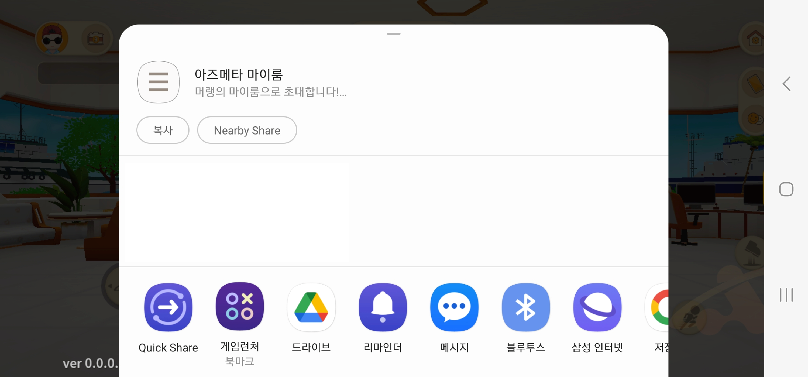
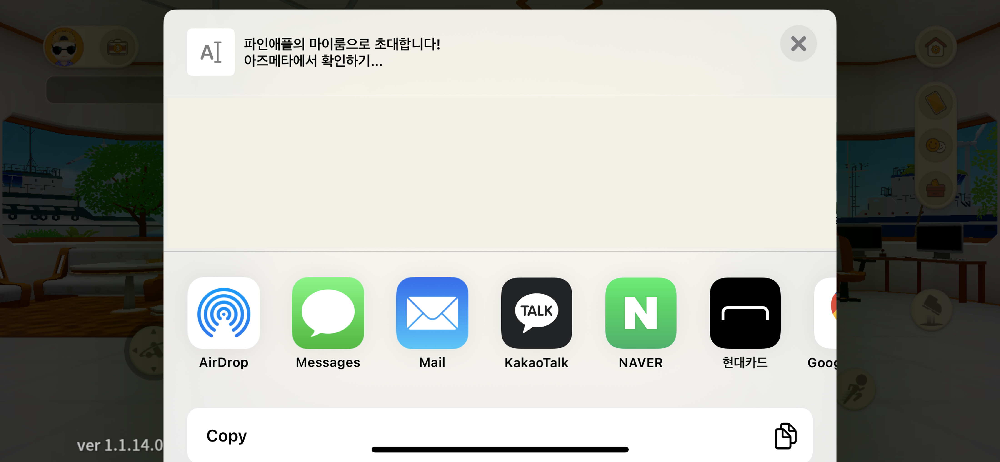

# DynamicLink/DeepLink 기능


모바일 버전과 Standalone Windows 버전은 전처리문으로 나누어 코드 작성되어있음


<details>

<summary>관련 스크립트</summary>

[Firebase DynamicLink](../../asset/sdk/firebase-1/dynamiclink-aos-ios.md), [Standalone DeepLink](../../asset/sdk/dynamiclink-standalone-windows.md) 세팅 : Assets\\\_DEV\Script\MobileShare\DynamicLinkSetting.cs

공유 목적에 맞게 링크 생성 : Assets\\\_DEV\Script\MobileShare\CreateShareLink.cs

링크에 따른 join 로직 처리 : Assets\\\_DEV\Script\MobileShare\JoinShareLink.cs

</details>

> Firebase DynamicLink는 [변고경 연구원의 인수인계자료](../undefined.md) 5번 참고부탁드립니다.

## 공유  링크  종류 <a href="#undefined" id="undefined"></a>

### 마이룸 <a href="#undefined" id="undefined"></a>

#### 마이룸 초대(MYROOM\_ENTER)

<div align="left">

<figure><figcaption><p>프로필 우측 공유하기 버튼을 누르면 공유 가능</p></figcaption></figure>

 

<figure><figcaption><p>카톡 공유 예시</p></figcaption></figure>

</div>

### 오피스룸

#### 오피스룸 초대(OFFICE\_ENTER)

1\. 비밀번호가 없는 경우

<div align="left" data-full-width="false">

<figure><figcaption><p>룸코드 우측 공유하기 버튼을 누르면 공유 가능</p></figcaption></figure>

 

<figure><figcaption><p>카톡 공유 예시</p></figcaption></figure>

</div>

2. 비밀번호가 있는 경우

초대 링크를 누르면 비밀번호 입력없이 자동으로 오피스룸에 입장된다.

<div>

<figure><figcaption><p>룸코드 우측 공유하기 버튼을 누르면 공유 가능</p></figcaption></figure>

 

<figure><figcaption><p>카톡 공유 예시</p></figcaption></figure>

</div>

#### 오피스룸 정보 공유(OFFICE\_INFO)

<div>

<figure><figcaption><p>왼쪽 하단 공유하기 버튼을 누르면 공유 가능</p></figcaption></figure>

 

<figure><figcaption><p>카톡 공유 예시</p></figcaption></figure>

</div>

## 전체적인 로직

1. 공유 목적에 따라 공유 링크를 다르게 생성합니다. 그리고 <mark style="color:green;">모바일의 경우</mark> 공유하기 버튼을 눌렀을 때 각 모바일 기기 자체 공유 팝업(NativeShare)을 띄워 공유하고, <mark style="color:blue;">Standalone의 경우</mark> "초대링크가 복사되었습니다"라는 토스트 팝업이 뜨면서 클립보드에 공유되는 내용이 복사됩니다.

<div>

<figure><figcaption><p>Android에서 공유하기 버튼 눌렀을 때</p></figcaption></figure>

 

<figure><figcaption><p>iOS에서 공유하기 버튼 눌렀을 때</p></figcaption></figure>

</div>

3. 사용자가 초대 링크를 클릭하게 되면 DynamicLinkSetting.cs의 콜백 함수(모바일은  [OnDynamicLinkReceived()](../../asset/sdk/firebase-1/dynamiclink-aos-ios.md#dynamic-link), Standalone은 [OnPCDynamicLinkReceived()](../../asset/sdk/dynamiclink-standalone-windows.md#deep-link-1))가 호출되어, url에 포함되어있는 파라미터를 Dictionary 형태로 파싱하여 저장합니다.
4. JoinShareLink.cs의 이벤트 OnParamReceived()가 호출되어 파싱된 파라미터를 받아와 다이나믹 링크 로직이 활성화되어있는 씬인지 확인 후 공유 링크 타입(roomType)에 따라 Join 로직을 실행합니다.

### 공유 링크 생성 및 공유

공유하고자 하는 곳에서 공유 링크에 필요한 데이터(ShareLinkInfo)를 파라미터로 포함하여  CreateShareLink.cs의 CreateLink(ShareLinkInfo)([모바일](../../asset/sdk/firebase-1/dynamiclink-aos-ios.md#firebase-dynamiclinks), [PC](../../asset/sdk/dynamiclink-standalone-windows.md#deep-link))을 호출하여 공유 링크를 생성하여 공유한다.&#x20;

```csharp
// 다이나믹 링크 정보
public class ShareLinkInfo
{
    public SHARELINK_TYPE roomType;
    public string nickName;
    public string roomName;
    public string roomId;
    public string spaceInfoId;
    public string description;
    public string roomCode;
    public int isPassword = 0;
    public string password;
    public int topicType;
    public string startTime;
}
```

### 사용자가 공유받은 링크 클릭

[모바일](../../asset/sdk/firebase-1/dynamiclink-aos-ios.md#dynamic-link) / [PC](../../asset/sdk/dynamiclink-standalone-windows.md#deep-link-1) 콜백 함수에서 JoinShareLink.cs의 OnParamReceived() 이벤트를 호출해 공유 링크 로직이 활성화될 수 있는 씬인지 확인(CheckSceneAndJoin(현재 씬 이름) 후 해당 씬에 따라 Join 로직을 실행시킨다.

```csharp
// Assets\_DEV\Script\MobileShare\JoinShareLink.cs
public void OnParamReceived(Dictionary<string, string> paramDic)
{
    Debug.Log("OnParamReceived");
        
    parameters = paramDic;
    
    // 현재 씬이 공유 링크 로직을 활성화할 수 있는 씬인지 확인 후, 활성화 가능한 씬이면 JoinRoom() 호출
    CheckSceneAndJoin(SceneManager.GetActiveScene().name);
}

private void CheckSceneAndJoin(string name)
{
    SceneName sceneName = Util.String2Enum<SceneName>(name);

    if (LocalPlayerData.IsLogined)
    {
        switch (sceneName)
        {
            // TODO : 필요시 씬 추가해야함
            case SceneName.Scene_Land_Arz:
            case SceneName.Scene_Land_Busan:
            case SceneName.Scene_Room_MyRoom:
            case SceneName.Scene_Zone_Conference:
            case SceneName.Scene_Zone_Game:
            case SceneName.Scene_Zone_Office:
            case SceneName.Scene_Zone_Store:
            case SceneName.Scene_Zone_Vote:
            case SceneName.Scene_Zone_Exposition:
                JoinRoom();
                break;
            default:
                Debug.Log($"[ArzmetaShare] {sceneName}에서는 다이나믹 링크로 받은 파라미터를 활용한 로직 처리가 없습니다.");
                return;
        }
    }
    else return;
}

/// <summary>
/// 다이나믹 링크에 따른 join 로직 구현
/// </summary>

public void JoinRoom()
{
    if (HasParameters() == false)
    {
        Debug.LogWarning("파라미터가 존재하지 않습니다.");
        return;
    }

    SHARELINK_TYPE roomType = (SHARELINK_TYPE)Enum.Parse(typeof(SHARELINK_TYPE), parameters["roomtype"]);
    switch (roomType)
    {
        case SHARELINK_TYPE.OFFICE_ENTER:
            JoinOfficeRoom();
            break;
        case SHARELINK_TYPE.OFFIICE_INFO:
            ShowOfficeInfo();
            break;
        case SHARELINK_TYPE.MYROOM_ENTER:
            JoinMyRoom();
            break;
    }

    ClearCachedParameters();
}

/// <summary>
/// 오피스룸 입장 로직
/// </summary>
private async void JoinOfficeRoom()
{
    Debug.Log($"오피스룸 입장 / + {parameters["roomid"]}");
    
    var panel = SceneLogic.instance.GetPanel<Panel_Office>();
    panel.SuperJoin(parameters);

    await UniTask.NextFrame();
}

/// <summary>
/// 오피스룸 정보 보여주는 로직
/// </summary>
private async void ShowOfficeInfo()
{
    string roomCode = parameters["roomcode"];
    Debug.Log($"오피스룸 정보 보여주기 / " + roomCode);

    var panel = SceneLogic.instance.GetPanel<Panel_Office>();
    panel.SearchAndJoin(roomCode);

    await UniTask.NextFrame();
}

/// <summary>
/// 마이룸 입장 로직
/// </summary>
private void JoinMyRoom()
{
    Debug.Log($"마이룸 입장 / {parameters["roomcode"]}");

    string roomCode = parameters["roomcode"];
    string roomId = parameters["roomid"];

    LocalContentsData.scenePortal = ScenePortal.MyRoom;

    // 현재 자신의 마이룸인데 자신의 마이룸으로 가려고 하거나 입장하려는 마이룸에 이미 와있는 경우 예외처리
    if (SceneLogic.instance.GetSceneType() == SceneName.Scene_Room_MyRoom)
    {
        if (roomCode == LocalPlayerData.MemberCode || roomId == LocalContentsData.roomId)
        {
            LocalContentsData.scenePortal = ScenePortal.None;
            return;
        }
    }
    else
        Single.RealTime.EnterRoom(RoomType.MyRoom, roomCode);
}
#endregion
```
