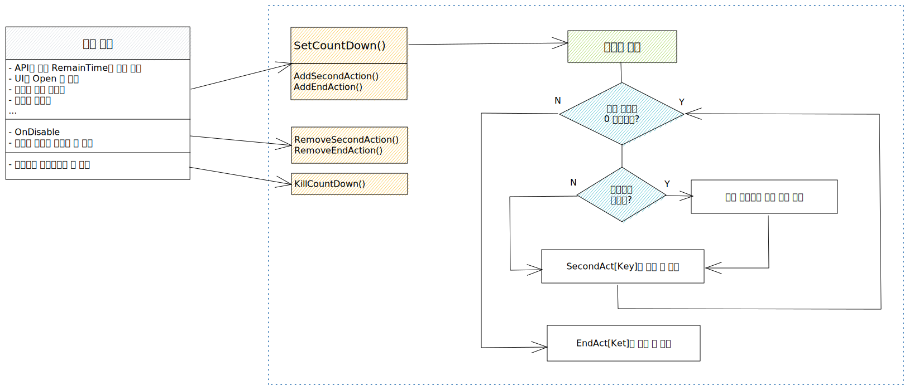

# 채팅 기능

기획서 위치 : PlanningTeamProject\004\_arzmeta\001\_기획안\001\_아즈메타\001\_공통 기능\013\_채팅



<details>

<summary>관련 스크립트</summary>

[웹소켓 : Assets\\\_DEV\Script\Framework\Manager\SocketManager.cs](../../base/manager/socketmanager.md)

채팅 모드에 따른 UI 변경 : Assets\\\_DEV\_Private\SJE\ChatModeController.cs

채팅 기능 : Assets\\\_DEV\Script\UI\View\View\_Chat.cs

[채팅 스크롤 아이템 : Assets\\\_DEV\Script\UI\Item\Item\_Chat.cs](../../asset/ui/gpm-infinitescroll-dynamicscroll.md)

</details>

## 채팅 모드와 채팅 종류



채팅 모드 변경으로 인한 UI 변경 스크립트 : Assets\\\_DEV\_Private\SJE\ChatModeController.cs

* 기본 모드 : 채팅한 줄만 미리보기로 보이는 스크롤이 없는 모드
* 채팅 모드 : 채팅을 보내고 볼 수 있는 [무한 스크롤 뷰](../../asset/ui/gpm-infinitescroll-dynamicscroll.md) [전체, 1:1, 시스템 채팅](undefined-2.md#undefined-4)이 있는 모드
* 숨김 모드 : 채팅을 숨기고 새로운 메세지가 왔을 때 new 아이콘을 표시해주는 모드

<div>

<figure><figcaption><p>기본 모드(StandardMode)</p></figcaption></figure>

 

<figure><figcaption><p>숨김 모드(HiddenMode)</p></figcaption></figure>

 

<figure><figcaption><p>채팅 모드(ChattingMode)</p></figcaption></figure>

</div>



실질적인 채팅 기능 스크립트 : Assets\\\_DEV\Script\UI\View\View\_Chat.cs

* 전체 채팅 : 월드 채팅(흰색 글자), 1:1 채팅<mark style="color:yellow;">(노란색 글자)</mark>, 시스템 채팅<mark style="color:green;">(녹색 글자)</mark>을 모두 모아볼 수 있는 채팅 모드로 씬을 옮기면 1:1 채팅 기록을 제외한 채팅은 초기화된다.
* 1:1 채팅 : 1:1 채팅만 모아볼 수 있는 채팅 모드로 내가 보낸 메세지는 <mark style="color:yellow;">\[@상대방닉네임]:메세지</mark>, 받은 메세지는 <mark style="color:yellow;">상대방닉네임:메세지</mark> 형태로 보이며 해당 채팅은 씬을 옮겨도 저장된다. @를 입력하면 최근에 1:1채팅한 사용자 리스트를 볼 수 있다.
* 시스템 채팅 : 시스템 채팅만 모아볼 수 있는 채팅 모드로 친구요청, 오피스 알림과 같은 시스템에서 전달되는 메세지를 보여준다. <mark style="color:red;">(\*\* 현재는 틀만 작성된 상태로 관련 기획이 추가되면 추가 개발이 필요합니다.)</mark>

<div>

<figure><figcaption><p>전체 채팅</p></figcaption></figure>

 

<figure><figcaption><p>1:1 채팅</p></figcaption></figure>

 

<figure><figcaption><p>시스템 채팅</p></figcaption></figure>

</div>






## 웹소켓 연결 및 채팅 초기화

1. SceneLogin\_Base.cs에서 씬에 따라 채팅 기능 사용 여부에 따른 bool값을 설정해줍니다. <mark style="color:red;">새로운 씬이 추가될 경우 case 또한 추가해줘야 합니다.</mark>

```csharp
// Assets\_DEV\Script\Framework\UI\SceneLogic_Base.cs
private void InitChat()
{
    var sceneType = GetSceneType();

    // TODO : 필요시 씬 추가해야 함
    switch (sceneType)
    {
        // 아웃월드
        case SceneName.Scene_Base_Loading:
        case SceneName.Scene_Base_Lobby:
        case SceneName.Scene_Base_Logo:
        case SceneName.Scene_Base_Patch:
        case SceneName.Scene_Base_Title:
            isChatEnabled = false;
            break;
        case SceneName.Scene_Land_Arz:
        case SceneName.Scene_Land_Busan:
        case SceneName.Scene_Room_Consulting:
        case SceneName.Scene_Room_Lecture:
        case SceneName.Scene_Room_Lecture_22Christmas:
        case SceneName.Scene_Room_Meeting:
        case SceneName.Scene_Room_Meeting_22Christmas:
        case SceneName.Scene_Room_Meeting_Office:
        case SceneName.Scene_Room_Exposition_Booth:
        case SceneName.Scene_Room_MyRoom:
        case SceneName.Scene_Zone_Conference:            
        case SceneName.Scene_Zone_Festival:
        case SceneName.Scene_Zone_Game
        case SceneName.Scene_Zone_Office:
        case SceneName.Scene_Zone_Store:
        case SceneName.Scene_Zone_Vote:
        case SceneName.Scene_Zone_Exposition:
        // 채팅 기능을 사용하지는 않지만 웹서버에 현재 접속 씬이름을 넘기기 위해 -> hud에서 채팅 UI 자체가 안뜸
        case SceneName.Scene_Room_JumpingMatching:
        case SceneName.Scene_Room_OXQuiz:
        default:
            isChatEnabled = true;
            break;
    }
}
```

2. 소켓 중복 연결을 피하기 위해 Title 씬에서 Touch To Start 버튼을 눌러 소켓을 연결하기 전에 현재 소켓의 연결 상태를 확인해 열려있을 경우 닫아줍니다.

```csharp
// Assets\_DEV\Script\Scene\Scene_Title.cs
protected override void Start()
{
    base.Start();
    
    // 웹소켓이 끊겨있지 않은 경우, 연결 해제 (ex. 로그아웃, 계정 전환 등)
    if (Single.Socket.socketManager != null)
    {
        if (Single.Socket.socketManager.State == BestHTTP.SocketIO3.SocketManager.States.Open)
        Single.Socket.socketManager.Close();
    }
    
    ---------------- 생략 -----------------
}
```

3. 로그인 -> 실시간 서버 연결 -> 웹서버 연결 및 1:1 채팅 안내 문구 노출 세팅

```csharp
// Assets\_DEV\Script\Framework\Manager\WebManager.cs
public void SetLocalPlayerData(LoginPacketRes res)
{
    ---------------- 생략 -----------------
    
    GetMemberInfo_Req((memberInfoRes) =>
    {
        LocalPlayerData.SetMemberInfo(memberInfoRes);
        SetEnter();
    });

    LocalPlayerData.IsLogined = true;

    // 첫 로그인, 첫 씬에서만 1:1 채팅 방법 안내 문구 추가
    if (LocalPlayerData.IsFirst)
        SetChatNotice();
}

public void SetEnter()
{
    if (string.IsNullOrEmpty(LocalPlayerData.NickName))
    {
        Single.Scene.FadeOut(1f, () => Single.Scene.LoadScene(SceneName.Scene_Base_Lobby));
    }
    else
    {
        RealtimeWebManager.GetLogin();

        RealtimeWebManager.Run<LoginRes>(GetSessionId);
    }

    // 웹소켓 연결
    Single.Socket.SocketIO3Connect();
    AppGlobalSettings.Instance.LoadData();
}

/// <summary>
/// 1:1 채팅 방법 안내 문구 출력
/// 최초 로그인 시, 전체 채팅과 1:1 채팅창에서 최상단에 한번만 출력함
/// </summary>
private void SetChatNotice()
{
    // 서버 에러로 인해 여러번 값이 추가되는 경우 방지
    if (LocalPlayerData.allChat.Count > 0 || LocalPlayerData.dmChat.Count > 0) return;

    // 자식 클래스인 Item_S_ChatDM을 통해
    Item_S_ChatDM item_Notice = new Item_S_ChatDM
    {
        message = "chat_notice_1on1",
        color = Cons.ChatColor_White,
    };

    // 부모클래스인 Item_ChatDefault에 값 추가
    LocalPlayerData.allChat.Add(item_Notice);
    LocalPlayerData.dmChat.Add(item_Notice);
}
```


## 채팅 UI 및 스크립트 구성

채팅 관련 스크립트는 크게 채팅 모드에 따른 UI를 변경하는 ChatModeController.cs와 채팅 종류에 따른 기능을 구현한 View\_Chat.cs으로 나뉩니다.

### ChatModeController.cs

채팅 모드가 바뀔 때마다 해당 모드에 맞는 UI로 변경해줍니다.

```csharp
public CHAT_MODE ChatMode
{
    get => _chatMode;
    set
    {
        _chatMode = value;

        Co_ChangeMode().RunCoroutine();
    }
}

private IEnumerator<float> Co_ChangeMode()
{
    yield return Timing.WaitUntilTrue(() => initCompleted);

    SetActiveTrue(true);

    // 기본모드에서는 안내문구 미노출을 위해
    viewChat.RefreshScrollView();

    yield return Co_Effect().WaitUntilDone();

    SetActiveFalse(false);

#if UNITY_EDITOR || UNITY_STANDALONE
    // inputField에 Focusing
    if(ChatMode == CHAT_MODE.CHATTING) 
        viewChat.GetChatInputField().ActivateInputField();
#endif
}
```

채팅 모드에 따라 활성화되는 GameObject로 나눠 투명도(alpha)와 pivot을 조절하여 자연스럽게 UI가 변경되게 SetActiveTrue()와 SetActiveFalse()로 나누어 작성하였습니다.&#x20;

```csharp
/// <summary>
/// 채팅 모드에 따라 투명도(alpha값)와 pivot 조절
/// </summary>
/// <returns></returns>
private IEnumerator<float> Co_Effect()
{
    Single.Sound.PlayEffect(Cons.click);

    float curTime = 0f;
    float durTime = 0.28f;
    float targetPivot;

    while (curTime < 1f)
    {
        curTime += Time.deltaTime / durTime;

        switch (ChatMode)
        {
            case CHAT_MODE.STANDARD:
                topCV.alpha = Mathf.Abs(1 - curTime);
                previewCV.alpha = Mathf.Abs(curTime);
                chattingCV.alpha = Mathf.Abs(1 - curTime);
                bottomCV.alpha = Mathf.Abs(1 - curTime);
                noPermissionCV.alpha = Mathf.Abs(1 - curTime);
                break;

            case CHAT_MODE.CHATTING:
                // 숨김 모드 -> 채팅 모드
                if (overallRect.pivot.x != 0)
                {
                    targetPivot = Mathf.Lerp(1f, 0f, curTime);
                    overallRect.pivot = new Vector2(targetPivot, 0.5f);
                }

                // 기본 모드 -> 채팅 모드
                topCV.alpha = Mathf.Abs(curTime);
                previewCV.alpha = Mathf.Abs(1 - curTime);
                chattingCV.alpha = Mathf.Abs(curTime);

                if (Util.UtilOffice.IsOffice())
                {
                    // 오피스에서 채팅 권한이 없을 때, 인풋필드 비활성화 및 안내문구 활성화
                    bool isOfficeChatPermission = sceneOfficecRoom.myPermission.ChatPermission == true;

                    bottomCV.alpha = Mathf.Abs(isOfficeChatPermission ? curTime : 1 - curTime);
                    noPermissionCV.alpha = Mathf.Abs(isOfficeChatPermission ? 1 - curTime : curTime);
                }
                else
                {
                    bottomCV.alpha = Mathf.Abs(curTime);
                    noPermissionCV.alpha = Mathf.Abs(curTime);
                }
                break;

            case CHAT_MODE.HIDDEN:
                targetPivot = Mathf.Lerp(0f, 1f, curTime);
                overallRect.pivot = new Vector2(targetPivot, 0.5f);

                previewCV.alpha = Mathf.Abs(1 - curTime);
                chattingCV.alpha = Mathf.Abs(1 - curTime);
                noPermissionCV.alpha = Mathf.Abs(1 - curTime);
                break;
        }

        yield return Timing.WaitForOneFrame;
    }
}

/// <summary>
/// 채팅 모드에 따른 게임오브젝트 활성화
/// </summary>
/// <param name="active"></param>
private void SetActiveTrue(bool active)
{
    togplus_Chat.gameObject.SetActive(active);
    switch (ChatMode)
    {
        case CHAT_MODE.STANDARD:
            go_Preview.SetActive(active);
            break;
        case CHAT_MODE.CHATTING:
            go_Chatting.SetActive(active);
            go_Top.SetActive(active);
            if (viewChat.ToggleType != CHAT_TYPE.SYSTEM)
                go_Bottom.SetActive(active);
            if (Util.UtilOffice.IsOffice() && sceneOfficecRoom.myPermission.ChatPermission == false)
            {
                go_Bottom.SetActive(!active);
                txtmp_NoPermission.gameObject.SetActive(active);
            }
            break;
    }
}
    
/// <summary>
/// 채팅 모드에 따른 게임오브젝트 비활성화
/// </summary>
/// <param name="active"></param>
private void SetActiveFalse(bool active)
{
    switch (ChatMode)
    {
        case CHAT_MODE.STANDARD:
            go_Top.SetActive(active);
            go_Bottom.SetActive(active);
            go_Chatting.SetActive(active);
            txtmp_NoPermission.gameObject.SetActive(active);
            break;
        case CHAT_MODE.CHATTING:
            go_Preview.SetActive(active);
            break;
        case CHAT_MODE.HIDDEN:
            go_Top.SetActive(active);
            go_Preview.SetActive(active);
            go_Chatting.SetActive(active);
            go_Bottom.SetActive(active);
            txtmp_NoPermission.gameObject.SetActive(active);
            break;
    }
}
```

오피스룸에서 채팅 권한 여부에 따라 인풋필드를 활성화/비활성화합니다.

```csharp
public void SetOfficeChatPermission(bool isActive)
{
    if (ChatMode == CHAT_MODE.CHATTING)
    {
        go_Bottom.SetActive(isActive);
        txtmp_NoPermission.gameObject.SetActive(!isActive);

        float curTime = 0f;
        float durTime = 0.28f;

        while (curTime < 1f)
        {
            curTime += Time.deltaTime / durTime;

            bottomCV.alpha = Mathf.Abs(isActive ? curTime : 1 - curTime);
            noPermissionCV.alpha = Mathf.Abs(isActive ? 1 - curTime : curTime);
        }
    }
}
```

채팅 모드에서 채팅 UI 이외의 영역을 클릭했을 시, 기본 모드로 전환되게 하기 위해 HUD 터치 이벤트 중 onPointerClick 이벤트를 사용하여 구현하였고, 기본 모드에서 채팅 모드로 변경하기 위해 해당 스크립트에서 IPointerClickHandler를 상속받아 onPointerClick 이벤트를 사용하여 구현하였습니다.

<pre class="language-csharp"><code class="lang-csharp"><strong>private void Awake()
</strong><strong>{
</strong><strong>    ---------------- 생략 ----------------
</strong><strong>    
</strong><strong>    // Touch Event AddListener
</strong>    eventChecker = hud.Touch.eventChecker;
    eventChecker.onPointerClick.AddListener(ReleaseChatMode);
<strong>}
</strong><strong>
</strong><strong>private void ReleaseChatMode(PointerEventData eventData)
</strong>{
    if (eventChecker.clicked)
    {
        if (ChatMode == CHAT_MODE.CHATTING)
            ChatMode = CHAT_MODE.STANDARD;
    }
}

// View_Chat.prefab에 붙어있는 스크립트이기 때문에 View_Chat이 클릭된다.
public void OnPointerClick(PointerEventData eventData)
{
    ChangeChatMode();
}

public void ChangeChatMode()
{
    if (ChatMode == CHAT_MODE.STANDARD)
        ChatMode = CHAT_MODE.CHATTING;
}
</code></pre>

### View\_Chat.cs

1. 채팅에서 사용하는 [InfiniteScoll](../../asset/ui/gpm-infinitescroll-dynamicscroll.md)은 총 3개입니다.

* ScrollView\_Preview : 기본 모드에서 사용하는 **스크롤 기능이 없는 스크롤 뷰**
* ScrollView\_Chat : 채팅 모드에서 사용하는 **무한 스크롤 뷰**
* ScrollView\_UserList : 채팅 모드에서 @ 입력 시 활성화되는 1:1 채팅 유저 리스트 **무한 스크롤 뷰**


2. 토글 타입에 따라 토글 글자와  UI 변경, new 아이콘 비활성화, 각 토글에 해당되는 채팅 데이터를 불러옵니다.

```csharp
/// <summary>
/// 순환 토글 변환 변수
/// </summary>
public CHAT_TYPE ToggleType
{
    get => _toggleType;
    set
    {
        _toggleType = value;

        ChangeToggleType();
    }
}
public void ChangeToggleType()
{
    // 토글 타입에 따라 글자, new 아이콘 비활성화
    MasterLocalData result = null;
    switch (ToggleType)
    {
        case CHAT_TYPE.ALL:
            result = new MasterLocalData("common_all");
            break;
        case CHAT_TYPE.WHISPER:
            result = new MasterLocalData("chat_type_1on1");
            if (IsNewWhisper) IsNewWhisper = false;
            break;
        case CHAT_TYPE.SYSTEM:
            result = new MasterLocalData("setting_system");
            if (IsNewSystem) IsNewSystem = false;
            break;
    }

    Util.SetMasterLocalizing(txtmp_ChatType, result);

    // 현재 스크롤뷰 데이터를 비워주고, 각 토글에 해당되는 채팅 데이터가 있으면 불러오기
    RefreshScrollView();

    // 채팅모드일 때, 토글타입에 따른 UI 변경
    if (chatModeController.ChatMode == CHAT_MODE.CHATTING)
        ChangeUI();
    else if (chatModeController.ChatMode == CHAT_MODE.STANDARD)
        SceneLogic.instance.isEscapeLock = false; 

#if UNITY_EDITOR || UNITY_STANDALONE
    // inputField에 Focusing
    input_Chat.ActivateInputField();
#endif
}
```

3. 초기화

```csharp
protected override void Awake()
{
    base.Awake();

    // 채팅 핸들러 등록
    AddHandler();

    // @상대닉네임:에서 :지워지면 인풋필드 비우기
    input_Chat.onValueChanged.AddListener(OnInputFieldValueChanged);

    input_Chat.onSubmit.AddListener(OnInputReturn);
}

private void AddHandler()
{
    // 채팅 핸들러 등록
    Single.Socket.item_S_ChatMessage_Handler += S_ChatMessage;
    Single.Socket.item_S_ChatDM_Handler += S_ChatDM;
    Single.Socket.item_S_ChatSystem_Handler += S_ChatSystem;

    // 닉네임 변경 콜백 핸들러 등록
    RealtimeUtils.AddHandler(RealtimePacket.MsgId.PKT_S_SET_NICKNAME_NOTICE, this, S_SET_NICKNAME_NOTICE);
}
```

4. 전체 채팅, 1:1 채팅 송수신 기능, 시스템 채팅 수신 기능 구현(View\_Chat.cs 코드와 주석 확인부탁드립니다.)

